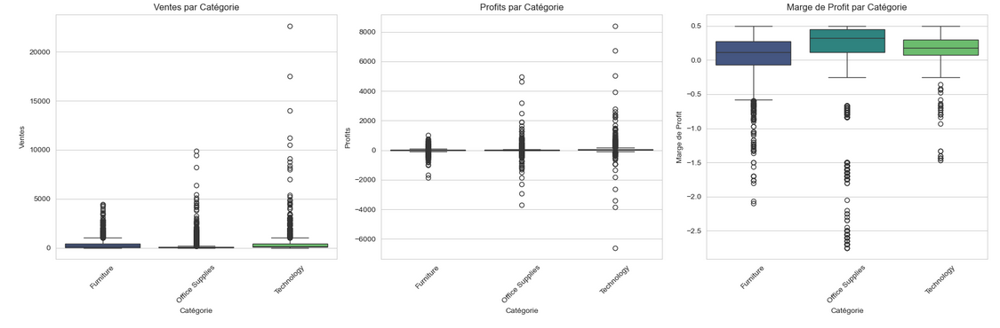
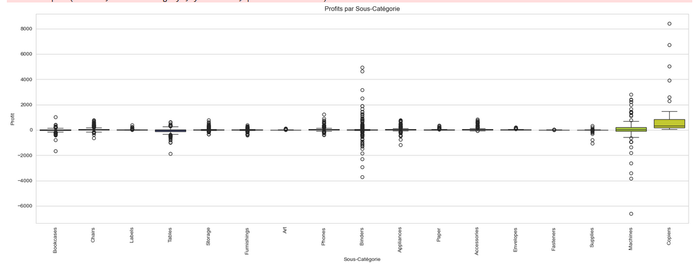
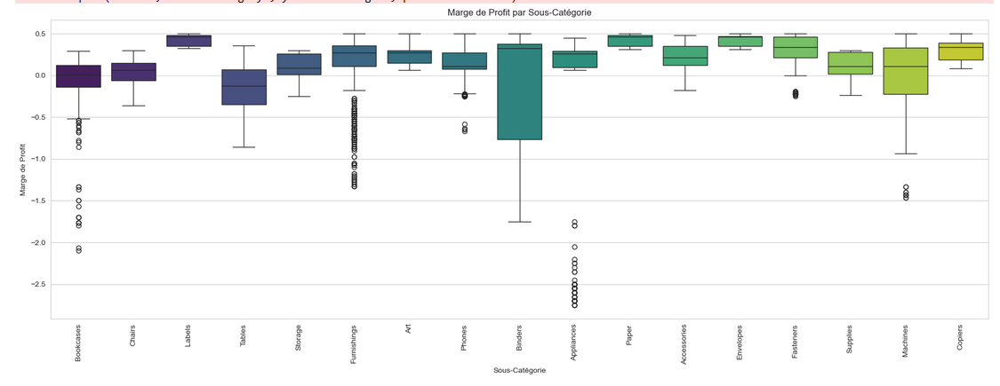
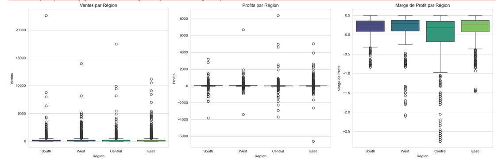
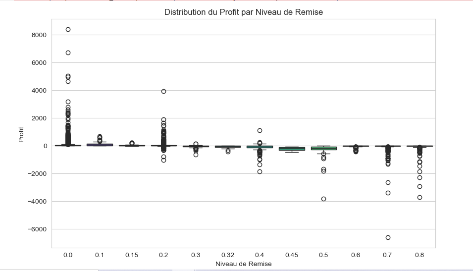
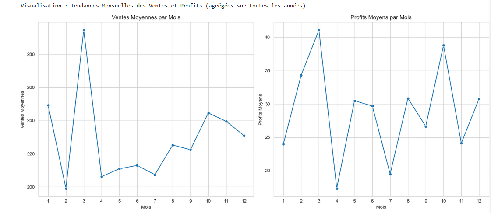

# Analyse et Optimisation des Performances de Ventes et Profits - Dataset Superstore

## 1. Introduction

Ce projet de data science explore le dataset "Superstore" afin d'analyser les performances de ventes et de profits d'une chaîne de magasins. L'objectif est de comprendre les dynamiques qui influencent la rentabilité des produits et des régions, d'identifier les segments clients clés, et de formuler des recommandations stratégiques pour optimiser la performance commerciale.

## 2. Problématique Business

Comment une entreprise de distribution peut-elle comprendre les interactions entre ses produits, ses performances dans différentes régions et ses marges de profit pour optimiser sa stratégie commerciale et augmenter sa rentabilité ?

## 3. Dataset

Les données utilisées pour cette analyse proviennent du dataset **Superstore**, disponible sur Kaggle :

[Lien vers le dataset Superstore sur Kaggle](https://www.kaggle.com/datasets/vivek468/superstore-dataset-final)

Ce dataset contient des informations transactionnelles sur les commandes passées, incluant des détails sur les produits vendus (catégorie, sous-catégorie), les quantités, les prix de vente, les remises, les profits, les dates de commande et d'expédition, les informations client (segment, nom), et les informations géographiques (pays, région, état, ville, code postal). Il comprend 9994 transactions et 21 colonnes.

## 4. Objectifs du Projet

Les principaux objectifs de ce projet sont les suivants :

* Réaliser une Analyse Exploratoire des Données (EDA) approfondie pour comprendre les distributions des variables clés et les relations initiales.
* Analyser les performances de ventes, profits et marges par catégorie de produit, sous-catégorie, région, et segment client.
* Analyser l'impact de la remise sur la rentabilité.
* Identifier les tendances temporelles et la saisonnalité des ventes et profits.
* Segmenter la base de clients en groupes distincts basés sur leur comportement d'achat (méthode RFM et clustering KMeans).
* Formuler des recommandations stratégiques basées sur les insights tirés de l'EDA et de la segmentation.

## 5. Méthodologie et Étapes du Projet

Le projet a été mené selon les étapes suivantes (détaillées dans [`notebooks/superstore_analysis.ipynb`]) :

1.  **Chargement et Inspection des Données :** Importation du dataset, vérification des types de données, des valeurs manquantes et des premières statistiques.
2.  **Nettoyage des Données et Feature Engineering :** Conversion des dates, création de caractéristiques temporelles (année, mois, jour de la semaine), et calcul de la marge de profit.
3.  **Analyse Exploratoire des Données (EDA) :** Visualisation des distributions, exploration des relations entre les variables (catégorielles, numériques, temporelles), identification des patterns clés (performance par catégorie/région, impact de la remise, tendances).
4.  **Segmentation Client :**
    * Calcul des métriques RFM (Récence, Fréquence, Monétaire).
    * Préparation des données RFM (transformation et standardisation).
    * Détermination du nombre optimal de clusters (Méthode du Coude).
    * Application de l'algorithme KMeans.
    * Analyse et caractérisation des segments clients identifiés.
5.  **Recommandations et Conclusion :** Synthèse des découvertes clés, formulation de recommandations stratégiques concrètes, identification des limitations de l'étude et proposition de prochaines étapes.

## 6. Recommandations et Conclusion

Après avoir exploré le dataset Superstore en détail et segmenté la base de clients, nous synthétisons ici nos découvertes clés et proposons des recommandations pour optimiser la stratégie commerciale de l'entreprise.

### 6.1 Synthèse des Découvertes Clés

Basé sur l'Analyse Exploratoire des Données (EDA) et la Segmentation Client :

* **Performances par Catégorie et Sous-Catégorie :**

    L'analyse des performances de ventes, profits et marges au niveau des catégories et sous-catégories de produits révèle des dynamiques clés qui influencent la rentabilité globale.

    Au niveau des grandes catégories, la **catégorie Technologie** génère les ventes les plus élevées par transaction individuelle et présente le plus grand potentiel de profits élevés. Cependant, elle est aussi associée à une forte variabilité, impliquant un risque important de pertes sur certaines transactions. La catégorie **Office Supplies** représente un volume de transactions très élevé (souvent de plus petites ventes unitaires) et montre une rentabilité typique plus stable, bien que modérée. La catégorie **Furniture**, quant à elle, se distingue par une rentabilité typique plus faible et est particulièrement sujette à générer des pertes importantes sur certains articles, impactant sa marge globale.

    **Box plots Ventes, Profits, Marge par Catégorie**

    

    En plongeant au niveau des sous-catégories, les responsables des pertes majeures sont clairement identifiés comme les **Tables** et les **Bookcases**, qui affichent non seulement des profits bruts négatifs sur de nombreuses transactions mais aussi des marges de profit typiquement défavorables. À l'inverse, les **Copiers (Photocopieurs)** se positionnent comme les produits les plus profitables, avec des profits bruts et des marges de profit unitaires très élevés. D'autres sous-catégories de la catégorie Technologie comme les **Phones** et **Machines** présentent un potentiel de profit élevé mais avec une variabilité plus marquée. Il est également intéressant de noter que des sous-catégories comme les **Binders** et **Paper** affichent une marge de profit saine, même si leur contribution au profit brut total est moindre comparée aux articles de haute valeur unitaire.

    **Box plots Profits et Marge par Sous-Catégorie**

    

    

    Cette analyse met en évidence la nécessité d'une stratégie différenciée selon les produits, en ciblant les "champions" et en adressant les "mauvais élèves" pour améliorer la rentabilité.

* **Performances par Région :**
    Basée sur les box plots des ventes, profits et marges par région, l'analyse montre que les régions ne sont **pas fortement différenciées** par leur rentabilité ou leur marge typique par transaction, qui tendent à être similaires et proches de zéro partout. Cependant, les régions **Ouest** et **Est** se distinguent potentiellement par un volume plus élevé de transactions à **ventes unitaires importantes**. Le potentiel de profits élevés et le risque de pertes importantes, ainsi que le problème des marges fortement négatives, semblent exister de manière comparable dans les quatre régions.

    **Box plots Ventes, Profits, Marge par Région**

    

* **Impact de la Remise :**
    L'analyse de la distribution des profits en fonction du niveau de remise révèle un impact majeur des promotions sur la rentabilité. Pour des **remises faibles (par exemple, 10-15%)**, l'impact sur le profit médian unitaire est limité. Cependant, à partir d'un seuil d'environ **20-30%**, l'application d'une remise est **fortement associée à un basculement rapide du profit médian en territoire négatif**. Les remises plus élevées (30% et plus) entraînent des pertes sur la majorité des transactions et augmentent considérablement le risque de pertes unitaires très importantes.

    **Box plot Profit par Niveau de Remise**

    

* **Tendances Temporelles :**
    L'analyse temporelle montre deux aspects clés. Premièrement, les ventes et les profits totaux enregistrent une **croissance positive et constante** d'année en année sur la période étudiée (depuis 2015, d'après l'observation de la tendance annuelle). Deuxièmement, il existe une **saisonnalité très marquée au cours de l'année**. Les ventes et profits connaissent typiquement un **creux en Mars**, remontent progressivement, et atteignent leurs **pics les plus élevés en Septembre et surtout en Novembre**, avant une légère baisse en Décembre. Cette saisonnalité se superpose à la tendance de croissance annuelle.

    **Graphiques des tendances temporelles**

    

    

    

* **Segmentation Client :**
    Afin de mieux comprendre et cibler les clients, une segmentation comportementale a été réalisée. En utilisant les métriques RFM (Récence : date du dernier achat ; Fréquence : nombre d'achats ; Monétaire : total dépensé) et l'algorithme de clustering KMeans, la base clients a été divisée en **2 groupes distincts** (K=2, choisi suite à l'analyse de la méthode du coude et pour une interprétation simplifiée).

    L'analyse des caractéristiques de ces clusters révèle deux segments principaux :
    * Le **Cluster 0 ("Clients Inactifs / Faible Valeur")** se caractérise par une **récence élevée** (leurs derniers achats remontent à plus longtemps), une **fréquence d'achat faible** et un **monétaire total peu élevé**. Ce groupe représente les clients qui ne sont pas activement engagés avec l'entreprise ou qui génèrent peu de valeur.
    * Le **Cluster 1 ("Clients Actifs / Forte Valeur")** regroupe les clients à **faible récence** (achats récents), **haute fréquence** et **monétaire élevé**. Ce sont les clients les plus précieux et les plus actifs de l'entreprise.

    Bien que l'analyse croisée avec d'autres variables (segments clients standards, régions) n'ait pas montré de différences de répartition majeures entre ces deux clusters, une légère tendance suggère que le Cluster 1 a une proportion légèrement plus élevée de transactions dans la catégorie Technologie. Cette segmentation est cruciale car elle permet de dépasser les descriptions démographiques ou géographiques pour cibler les clients en fonction de leur comportement réel d'achat, ouvrant la voie à des stratégies marketing et commerciales différenciées.

    **Graphiques liés à la Segmentation Client**

    

    

    


### 6.2 Recommandations Stratégiques

Basé sur les insights tirés de l'analyse exploratoire et de la segmentation client, nous proposons les recommandations stratégiques suivantes pour optimiser les performances de ventes et de profits :

1.  **Optimiser la Rentabilité du Portefeuille Produits :**
    * **Identifier et adresser les produits non profitables :** Une attention particulière doit être portée aux sous-catégories identifiées comme générant des pertes significatives, notamment les **Tables** et les **Bookcases**. Il est recommandé d'analyser en détail les raisons de ces pertes (coût d'achat élevé, coûts de livraison, prix de vente trop bas, retours fréquents ?) et d'envisager des actions correctives : ajustement des prix, négociation avec les fournisseurs, optimisation logistique, voire arrêt de la commercialisation si la rentabilité ne peut pas être améliorée.
    * **Capitaliser sur les produits les plus profitables :** Les sous-catégories très profitables, comme les **Copiers** et les **Phones**, devraient être mises en avant. Il est conseillé d'augmenter potentiellement les stocks pour ces articles, de les inclure dans des offres groupées, de les promouvoir activement, et de les proposer en priorité aux segments clients à forte valeur.

2.  **Réviser la Stratégie de Remise :**
    * L'analyse démontre clairement que les remises élevées nuisent considérablement à la rentabilité. Il est crucial de **réévaluer la politique de remise**, en particulier pour les niveaux de remise supérieurs visiblement autour de 20-30%, car ils sont fortement associés à des pertes.
    * Envisager de limiter les remises maximales autorisées, ou d'exclure certaines catégories/sous-catégories à faible marge (comme les Meubles, les Fournitures problématiques) des promotions importantes. L'objectif est de trouver un équilibre où les remises stimulent les ventes sans sacrifier excessivement les profits.

3.  **Mettre en Place des Stratégies Marketing et Commerciales Ciblées par Segment Client :**
    * **Pour le Cluster "Clients Actifs / Forte Valeur" :** Ce segment représente les clients les plus précieux. L'objectif est de les fidéliser et de maximiser leur valeur vie. Recommandations :
        * Développer un programme de fidélité exclusif ou des récompenses personnalisées.
        * Proposer des produits haut de gamme ou des nouveautés en avant-première.
        * Encourager les achats répétés et la vente croisée (basée par exemple sur l'analyse des produits fréquemment achetés ensemble).
    * **Pour le Cluster "Clients Inactifs / Faible Valeur" :** Ce segment nécessite une approche différente. L'objectif est de les réactiver si possible et de comprendre pourquoi ils sont moins engagés. Recommandations :
        * Lancer des campagnes de réactivation ciblées avec des offres attractives pour les inciter à commander à nouveau.
        * Mener potentiellement des enquêtes ou analyses supplémentaires pour comprendre les raisons de leur inactivité.
        * Définir un seuil de rentabilité : pour les clients peu susceptibles de devenir de grande valeur, il peut être plus efficace de concentrer les ressources sur les segments plus rentables.

4.  **Exploiter les Tendances Temporelles :**
    * **Planification Saisonnière :** Utiliser la saisonnalité identifiée (creux en Mars, pics en Septembre/Novembre) pour planifier les campagnes marketing, la gestion des stocks et les promotions. Concentrer les efforts avant et pendant les périodes de pic.
    * **Analyser le creux de Mars :** Mener une analyse plus approfondie pour comprendre pourquoi les ventes et profits chutent particulièrement en Mars. Des promotions spécifiques ou des campagnes de marketing pourraient-elles atténuer ce creux ?

### 6.3 Limitations du Projet

Cette analyse a fourni des insights précieux, mais il est important de noter certaines limitations :

* **Nature du Dataset :** Le dataset Superstore est un échantillon (potentiellement simplifié) de données transactionnelles. Il ne contient pas d'informations sur les activités marketing spécifiques menées, les actions des concurrents, les facteurs macroéconomiques, ou des détails potentiels sur les clients au-delà des données transactionnelles de base.
* **Données RFM :** Notre calcul de la Fréquence est basé sur le nombre de lignes de commande, et non sur le nombre de commandes uniques (un client achetant plusieurs articles en même temps aura plusieurs lignes mais une seule commande). Une analyse RFM plus granulaire pourrait nécessiter de recalculer la fréquence en comptant les IDs de commande uniques par client.
* **Choix de K :** La détermination du nombre de clusters (K=2) est basée sur l'interprétation de la méthode du coude et un jugement business. D'autres valeurs de K pourraient révéler des segments différents, potentiellement pertinents mais nécessitant une analyse plus approfondie (comme le Score Silhouette).
* **Modélisation Prédictive :** L'analyse des facteurs clés via l'importance des features d'un modèle simple (comme un Random Forest) donne une indication de l'influence relative des variables. Une modélisation prédictive complète des ventes ou profits futurs nécessiterait des étapes supplémentaires (sélection de modèle, hyperparamétrage, validation plus poussée).

### 6.4 Prochaines Étapes Potentielles

Pour construire sur les fondations de cette analyse et fournir encore plus de valeur business, les directions futures pourraient inclure :

* **Modélisation Prédictive Avancée :** Développer et déployer un modèle pour prédire les ventes et/ou profits au niveau de la transaction, du produit ou de la région. Cela permettrait une anticipation proactive des performances.
* **Analyse de la Valeur Vie Client (CLTV) :** Estimer la valeur potentielle future de chaque client. Combiner la CLTV avec la segmentation RFM permettrait de prioriser les efforts de rétention et d'acquisition sur les clients à plus fort potentiel.
* **Segmentation Plus Granulaire ou Alternative :** Explorer une segmentation plus fine (plus de clusters, ou en utilisant d'autres variables comportementales), ou une segmentation des produits (par exemple, basées sur leur volatilité, leur cycle de vie, ou leur association d'achat).
* **Analyse d'Association (Panier d'Achat) :** Découvrir les produits qui sont fréquemment achetés ensemble pour des recommandations de vente croisée ou l'optimisation du placement en magasin/en ligne.
* **Création d'un Tableau de Bord :** Développer un outil de visualisation interactif (utilisant par exemple Dash ou Streamlit) pour permettre aux équipes business d'explorer les performances par segment, région, produit, et de suivre les KPIs clés en temps réel.
* **Intégration de Données Externes :** Enrichir le dataset avec des données marketing (coût des campagnes, canaux utilisés), des données concurrentielles ou macroéconomiques pour identifier d'autres facteurs d'influence.

## 7. Détails Techniques

Le projet a été réalisé en utilisant Python avec les bibliothèques suivantes :

* `pandas` : Manipulation et analyse de données.
* `numpy` : Opérations numériques.
* `matplotlib` : Création de visualisations statiques.
* `seaborn` : Création de visualisations statistiques attractives.
* `sklearn` : Algorithmes de machine learning (StandardScaler, KMeans, potentiellement RandomForest pour l'importance des features si vous l'incluez).
* `IPython.display` : Amélioration de l'affichage dans le notebook.

## 8. Structure du Dépôt

La structure du dépôt GitHub est organisée comme suit :

```
mon_superstore_project/
├── README.md             # Ce fichier
├── notebooks/
│   └── superstore_analysis.ipynb  # Notebook Jupyter contenant tout le code et les analyses
├── data/
│   └── Superstore.csv    # Le dataset Superstore (à télécharger depuis Kaggle)
└── visualizations/       # Dossier pour sauvegarder les figures importantes de l'EDA (optionnel mais recommandé)
```

## 9. Comment Exécuter le Code

Pour exécuter ce projet et reproduire l'analyse, suivez les étapes ci-dessous :

1.  **Clonez le dépôt GitHub :**
    Ouvrez votre terminal ou invite de commande et exécutez :
    ```bash
    git clone [https://github.com/ThePerformer0/superstore-performance-analysis.git](https://github.com/ThePerformer0/superstore-performance-analysis.git)
    cd mon_superstore_project
    ```

2.  **Créez et activez un environnement virtuel :**
    Il est fortement recommandé d'utiliser un environnement virtuel pour isoler les dépendances du projet.
    ```bash
    # Crée un environnement virtuel nommé 'venv'
    python -m venv venv

    # Active l'environnement virtuel
    # Sur macOS et Linux :
    source venv/bin/activate
    # Sur Windows :
    # .\venv\Scripts\activate
    ```
    *(Après l'activation, vous devriez voir `(venv)` ou un nom similaire au début de votre ligne de commande).*

3.  **Installez les dépendances :**
    Avec l'environnement virtuel activé, installez toutes les bibliothèques nécessaires listées dans `requirements.txt` :
    ```bash
    pip install -r requirements.txt
    ```

4.  **Téléchargez le Dataset :**
    Téléchargez le fichier `Superstore.csv` depuis le lien Kaggle fourni dans la [section 3](#3-dataset) et placez-le dans le dossier `data/` à la racine du projet.

5.  **Lancez Jupyter Notebook ou JupyterLab :**
    Avec l'environnement virtuel toujours activé et depuis le répertoire racine du projet, lancez Jupyter :
    ```bash
    jupyter notebook
    # ou
    # jupyter lab
    ```

6.  **Ouvrez et Exécutez le Notebook :**
    Dans l'interface Jupyter qui s'ouvre dans votre navigateur, naviguez jusqu'au dossier `notebooks/` et ouvrez le fichier `superstore_analysis.ipynb`. Exécutez les cellules une par une pour suivre l'analyse et générer les visualisations.

## 10. Mes infos

- FEKE Jimmy 
- @ThePerformer0 sur Github
- Email : `fjimmywilson@gamil.com`